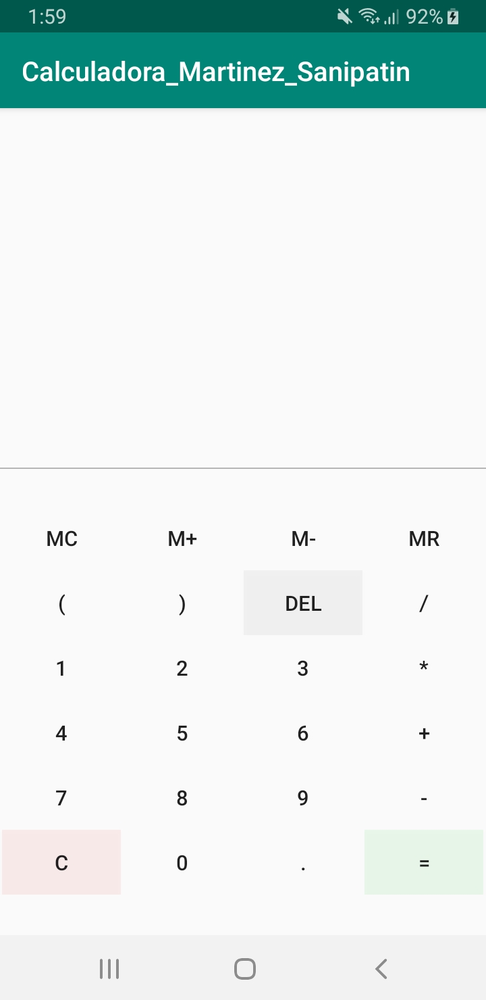
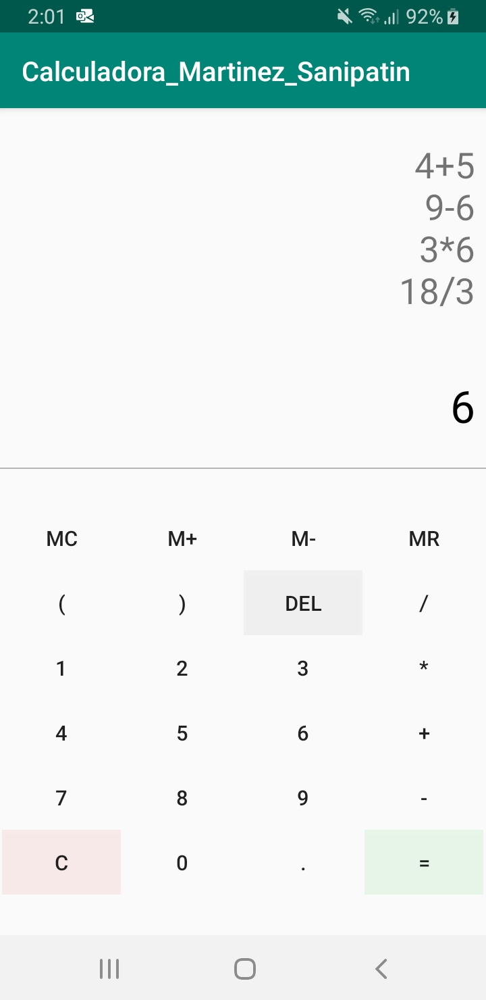
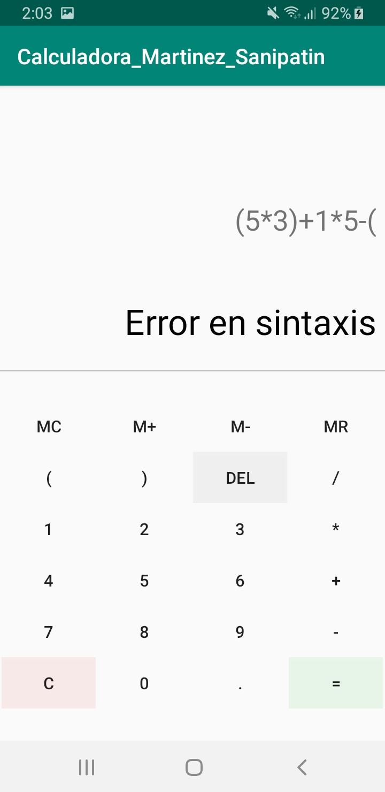
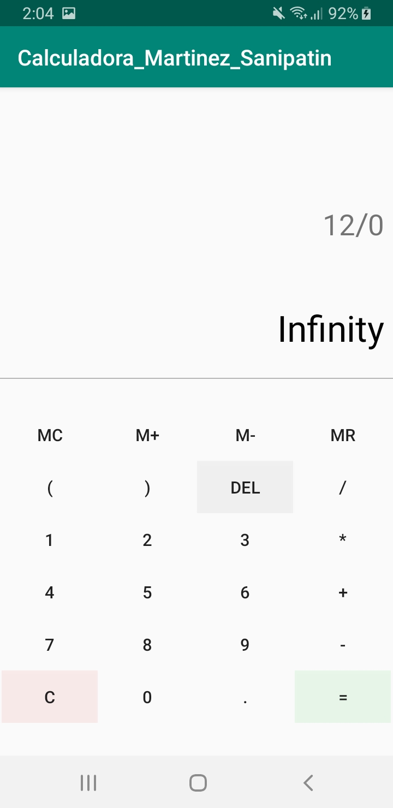
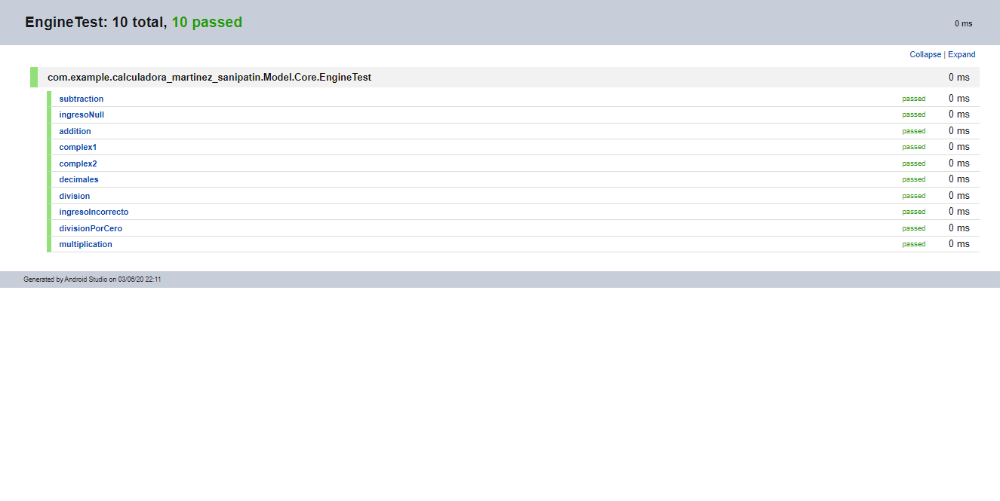
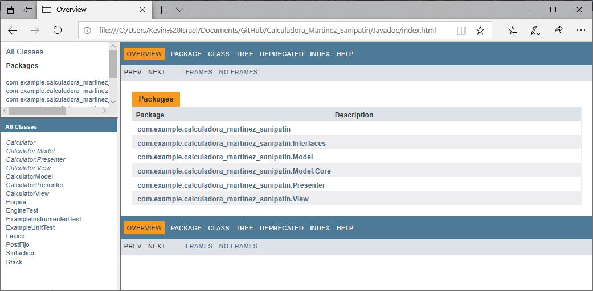

# Calculadora_Martinez_Sanipatin
Proyecto realizado en Android Studio.
Aplicación básica de calculadora que incluye las 4 operaciones primarias: suma, resta, multiplicación y división
## Capturas de pantalla
### Vista de la calculadora

### Operaciones básicas

### Operaciones complejas

### Error de Sintaxis

### División por Cero

## Modelo de la aplicación
El modelo de clases de la aplicación se lo puede encontrar [aquí](ClassDiagramMVP/DiagramClassMVP_Martinez_Sanipatin.pdf)

## Pruebas unitarias
A continuación se muestran los resultados de las pruebas unitarias

## Documentación
La Documentación del código se la puede encontrar [aquí](Javadoc/index.html)

