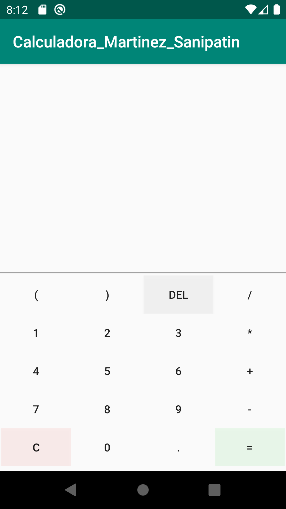
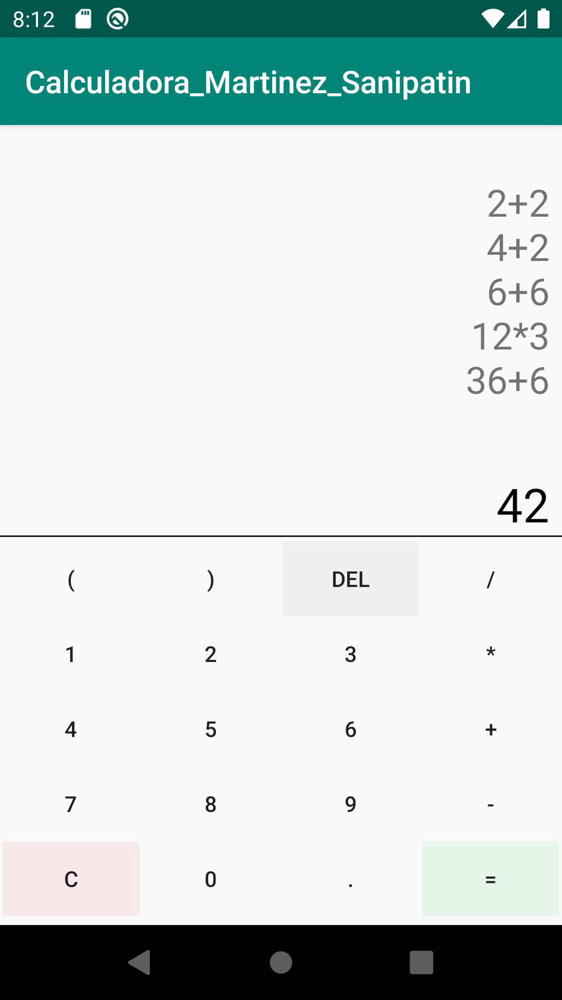
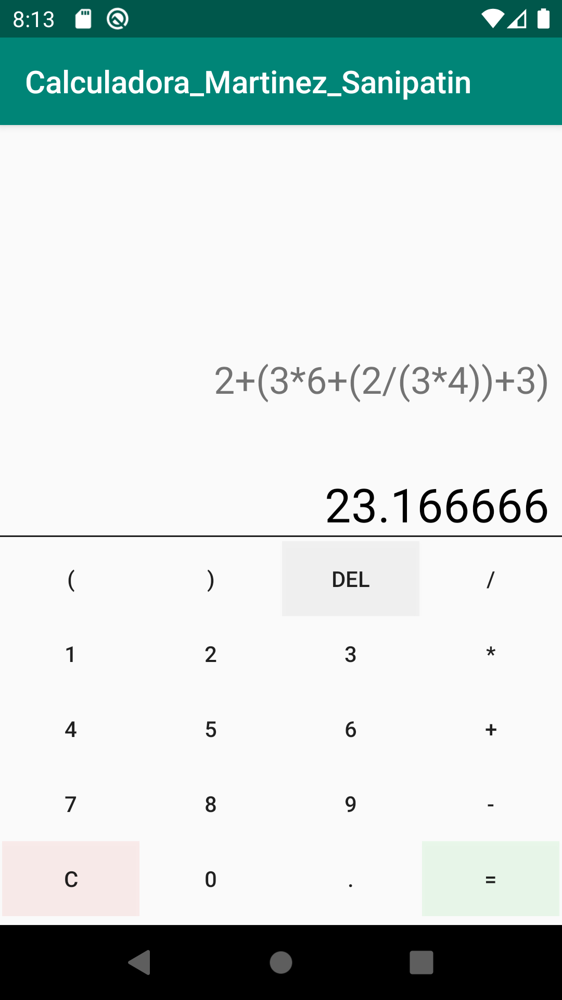

# Calculadora_Martinez_Sanipatin
Proyecto realizado en Android Studio.
Aplicación básica de calculadora que incluye las 4 operaciones primarias: suma, resta, multiplicación y división
## Capturas de pantalla
### Vista de la calculadora

### Operaciones básicas

### Operaciones complejas

## Modelo de la aplicación
El modelo de clases de la aplicación se lo puede encontrar en [ClassDiagramMVP/ClassDiagram_Martinez_Sanipatin.pdf]
