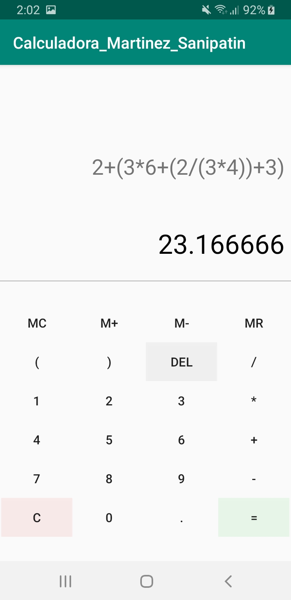

# Calculadora_Martinez_Sanipatin
Proyecto realizado en Android Studio.
Aplicación básica de calculadora que incluye las 4 operaciones primarias: suma, resta, multiplicación y división
## Capturas de pantalla
### Vista de la calculadora

### Operaciones básicas

### Operaciones complejas

### Error de Sintaxis

### División por Cero

## Modelo de la aplicación
El modelo de clases de la aplicación se lo puede encontrar [aquí](ClassDiagramMVP/DiagramClassMVP_Martinez_Sanipatin.pdf)

## Documentación
La Documentación del código se la puede encontrar [aquí](Javadoc/index.html)

## Metodología
La metodología utilizada es la Extreme Programming - XP.

XP es una metodologia para las pequeños y medianos equipos de desarrollo de software. XP es eficiente,
ligero,de bajo riesgo,flexible y una predecible manera cientifica de desarrollar software. Extreme Programming (XP)
fue concebido y desarrollado para hacer frente a las necesidades especificas de desarrollo 
de software llevadas a cabo por equipos pequeños. Esta nueva metodologia ligera desafia muchos postulados convencionales.

Se distingue de otras metodologias por:
  * Su respuesta temprana,concreto y continuo de ciclos cortos.
  * Su enfoque de planificacion incremental, que rapidamente se le ocurre
    un plan general que se espera que evolucione a traves de la vida de la
    proyecto.
  * Su capacidad de programar de forma flexible la aplicacion de
    funcionalidad, respondiendo a las necesidades cambiantes del negocio.
  * Su dependencia de un proceso de diseño evolutivo que dura
    como el sistema dura.

A continuación se muestra la contribución de los dos integrantes del equipo 

## Pruebas unitarias
A continuación se muestran los resultados de las pruebas unitarias

## Autores
 - Ismaes Martinez - Desarrollo de Software y Documentación - aimartinez1@espe.edu.ec
 - Kevin Sanipatin - Desarrollo de Software y Documentación - kisanipatin@espe.edu.ec

